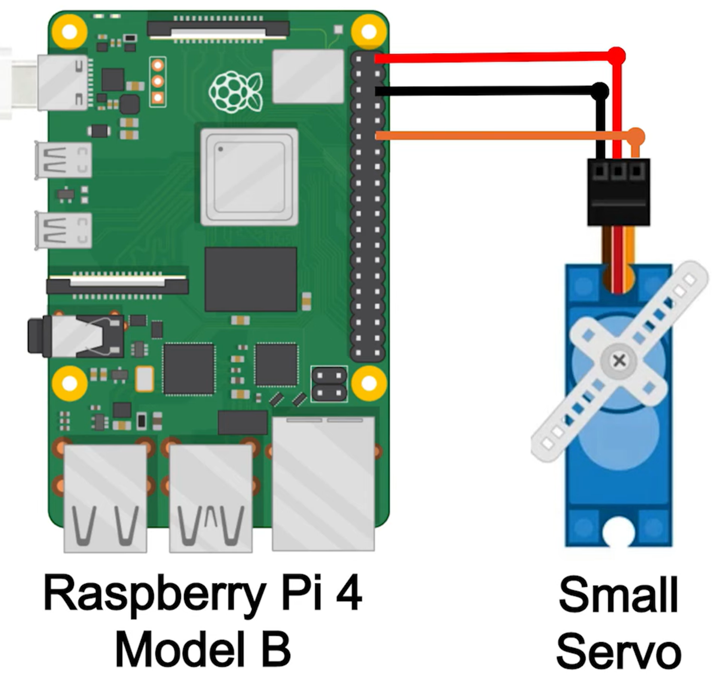
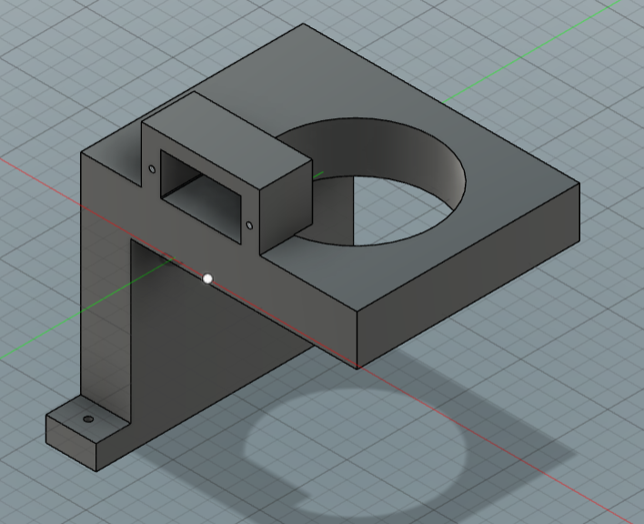

# servo_switch_DMPA6
Code, dependencies, procedure and design for automated on/off switch for DMP A6


## Intro

Every time we want to stream music from the Raspberry Pi to the DMP A6, at boot (of the RPi), the DMP A6 will be turned on tanks to a servo motor.

## Resource

[code & circuit](https://core-electronics.com.au/guides/control-servo-raspberry-pi/)

## Circuit

<p align="center">
  
</p>

## Code

find code [here](servo.py)

```
from gpiozero import AngularServo
from time import sleep

servo = AngularServo(15, min_pulse_width=0.0006, max_pulse_width=0.0023)

servo.angle = 0
sleep(2)
servo.angle = 70
sleep(2)
servo.angle = 0
sleep(2)
```

## Dependencies

> ssh in rpi

```
sudo apt install python3-gpiozero
sudo apt install python3-rpi.gpio python3-pigpio python3-lgpio
sudo usermod -aG gpio $USER
```

`ls -l /dev/gpiomem`

> crw------- 1 root root 239, 0 May 17 10:48 /dev/gpiomem

`sudo chown root:gpio /dev/gpiomem`

`ls -l /dev/gpiomem`

> crw------- 1 root gpio 239, 0 May 17 10:48 /dev/gpiome


`**sudo python3 servo.py**`

## Run at boot

1. Create a design to keep the servo in place, so it will be able to use his torque all against turn on button

    <p align="center">
        
    </p>

2. Once the code run, the servo is in pace and we see that the have enough torque to press the button, we have to run the code at boot

3. Every time we turn on the RPi, thanks to "System d Services" we execute the code to turn on the DMP A6.

4. _comming soon_